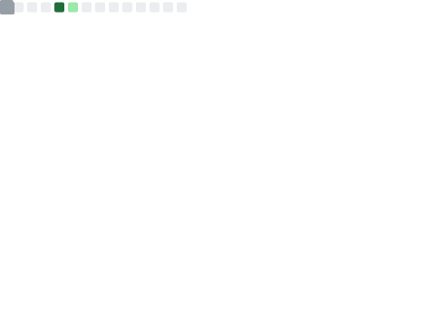

# Olá, me chamo  André Luiz  
 

### Sobre mim

* 💻 Eu sou um desenvolvedor Fullstack | Bioinformata | MSc. Microbiology
* 🌍  Estou localizado atualmente em: Juazeiro do Norte - CE | São Paulo - SP, Brasil
* 🔎 Também sou curioso sobre Ciberssegurança | Data Science | Bioinformática | Filosofia e Literatura Clássica
* ✒️ Eu gosto de no meu tempo livre treinar na academia ou muaythai, ler e assistir Rugby
* 📚 Lendo: "Hamlet" - relendo o origianl para treinar gramática inglesa
* 🤝  Estou aberto para colaborar com quaisquer projetos interessantes, entrem em contato comigo.
<!-- 
* 🖥️  Veja meu portfolio [aqui](http://andreluiz901.github.io)
* 👨‍💻 Projeto pessoal que estou desenvolvendo atualmente: [My App - Rede Social de Mensagens Curtas](https://my-blog-hgv5.vercel.app)
-->
  

### Premiações e Participações em Eventos

* Hack in Cariri - 2024 - <b>1° Lugar - Capture the Flag (CTF)</b>
* H2HC / Menina de Cybersec - 2024 - <b>1° Lugar - Mini Capture the Flag (CTF) Linear</b>
* Hack in Cariri - 2025 - <b>2° Lugar - Capture the Flag (CTF)</b>

### Principais Stacks

  

### Eu também já trabalhei com... 🔧

**Linguagens**

**Frameworks, Plataforms e Bibliotecas**

**Tecnologias e Ferramentas**

### Eu estou estudando... 🧩

### GitHub Stats ⚡

        

  <a href="https://github.com/andreluiz901">
  

### Entre em contato comigo! 📭
* ✉️  Entre em contato comigo por [email](mailto:andreluizsilva.dev@gmail.com) ou pelas minhas redes sociais:

  
  

#

<em>D.J.</em>

<em>S.D.G</em>

